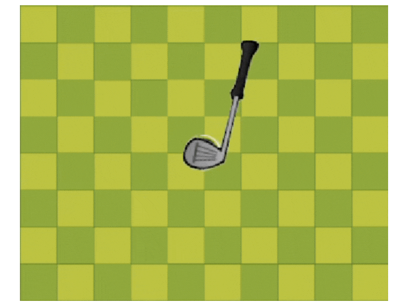

# GameProject
 
**Bài tập lớn** môn học **Lập trình nâng cao** 2324II_INT2215_22 - K68CA1
**Giảng viên:**
TS. Trần Thị Minh Châu
ThS. Kiều Hải Đăng
```
Họ và tên: Dương Gia Bảo
Lớp: K68CA1
MSSV: 23021475
```

### | Chủ đề Game: `Mini Golf by dgb`
Đây là một game giả lập chuyển động của quả bóng Golf bằng cách **kéo thả chuột** để định hướng và căn chỉnh lực cho quả bóng di chuyển. Game có 5 level chơi, trong các level sẽ có những vật cản như những **viên đá** sẽ làm quả bóng bật lại khi chạm vào, **slime** sẽ làm chậm tốc độ di chuyển quả bóng, **xương rồng** khi chạm vào thì người chơi sẽ thua cuộc. Người chơi sẽ chiến thắng khi đi qua hết **5 level**.


#### | Ngưỡng điểm sinh viên cho là xứng đáng: `9`
```
Lý do:
- Đây là game sinh viên tự làm
- Game có sử dụng các thư viện SDL mở rộng (SDL_image, SDL_mixer, SDL_ttf)
- Thuật toán về chuyển động của game được sinh viên tự sáng tạo và áp dụng, tự học và tự xử lý một số cơ chế
- Sử dụng được các nội dung đã học trong môn học (con trỏ, hàm, class, struct...)
- Game của sinh viên là game có đồ họa tự thiết kế, đẹp mắt, có nhạc nền sôi động
```

## | Cách tải Game
Cách 1: Tải code tại [link](https://github.com/dgb1106/GameProject/tree/main) ở dạng file zip, giải nén và mở file .exe

Cách 2: Tải code tại [link](https://github.com/dgb1106/GameProject/tree/main), cài CodeBlocks và thư viện SDL, cài đặt môi trường cho SDL lần đầu ở CodeBlocks

## | Tổng quan về Gameplay

#### Kéo thả chuột để quả bóng di chuyển


#### Di chuyển va chạm vào hòn đá


#### Di chuyển vào vùng slime


#### Nhặt box thêm thời gian


#### Xương rồng


#### Thắng level


#### Đếm ngược thời gian


Đây là toàn bộ những cơ chế cơ bản có trong game giúp đa dạng lối chơi và độ khó. Người chơi cần chọn cách di chuyển và căn chỉnh lực khéo léo để vượt qua các thử thách của trò chơi.

#### Điều kiện chiến thắng: vượt qua toàn bộ 5 level

# | Video Demo
Youtube: https://youtu.be/LNvfMJ4f58M

# | Tài nguyên
1. Đồ họa:
- Đa số đồ họa đều được sinh viên tự tay vẽ và thiết kế (có sử dụng các ứng dụng như Adobe Fresco, Canva...)
- Một số hình ảnh ở trong game được lấy từ [itch.io](https://itch.io/), [freepik](https://www.freepik.com)

2. Font chữ:
- [Dafont](https://www.dafont.com/)
- Canva

3. Nhạc nền và âm thanh phụ:
- [itch.io](https://itch.io/)
- [pixarbay](https://pixabay.com/music/search/game/)

4. Thuật toán, source code:
- Cơ chế, ý tưởng: game [TwiniGolf](https://www.youtube.com/watch?v=iEn0ozP-jxc) từ kênh Youtube [PolyMars++](https://www.youtube.com/@PolyMarsLIVE), Series [hướng dẫn làm game với SDL2](https://l.facebook.com/l.php?u=https%3A%2F%2Fyoutube.com%2Fplaylist%3Flist%3DPLhfAbcv9cehhkG7ZQK0nfIGJC_C-wSLrx%26si%3DBWRxdF580jgXODUn&h=AT13OEDZigP4oA20Tv7HP_heZbkzXQ2wmH9Z5KFxYoSRSEx83RV88BZbUjLPgUADQVuThOoPhfY475fkLsVDKEAmtWs4ff9V4kZ2TGKVulq-_kjf2wNlHedRCeqSSjrkUUvtjiCEHSb6knE&s=1) từ kênh Youtube Let's Make Game
- Thuật toán: tự xây dựng dựa trên kiến thức toán học, vật lý, tham khảo từ mentor, StackOverFlow, ChatGPT,...
- Nguồn học thư viện: tài liệu môn học, [lazyfoo](https://lazyfoo.net/), [SDLWiki](https://wiki.libsdl.org/SDL2/CategoryAPI), StackOverFlow

## | Những khó khăn và bài học kinh nghiệm

Ở đây, em xin phép nêu ra những khó khăn mà bản thân đã gặp phải trong suốt quá trình học và làm game rồi từ đó có cho bản thân những bài học kinh nghiệm quý giá.

- Khi bắt đầu: bị ngợp trước thư viện, kiến thức, chương trình, không biết phải bắt đầu từ đâu và như thế nào, gọi hàm giữa các class, các file khác nhau
- Khó khăn về việc kế thừa các class: em chưa bao giờ sử dụng công cụ này nên phải tìm hiểu từ đầu và sửa lỗi qua từng lần sử dụng, em đã thoát khỏi giai đoạn này bằng việc hỏi thêm giảng viên, xem các tutorial và hướng dẫn trên mạng, học các bài học của lazyfoo... để hiểu cơ chế của game và cách tổ chức chương trình phù hợp.
- Sử dụng con trỏ gây ra thất thoát bộ nhớ: trong quá trình làm game, có những con trỏ được cấp phát động và em chưa xóa nó đi khi không cần đến nữa trong khi nhịp game loop mới nó lại cấp phát động gây ra việc chương trình của em ngày một tiêu tốn nhiều bộ nhớ (dù chưa sập chương trình vì RAM cao), em đã sửa được lỗi này ở giai đoạn sau của kỳ học.
- Khó khăn trong việc tìm và sử dụng đồ họa: em có lên mạng và các trang về game để tìm kiếm đồ họa nhưng không được bộ assets nào ưng ý, vì vậy dù mất thời gian nhưng em đã quyết định sẽ tự tay vẽ và thiết kế đa số thành phần trong bộ đồ họa của mình.
- Khó khăn và mất thời gian trong việc fix bugs: có những lỗi ở trong chương trình xảy ra mà em mất rất nhiều thời gian để sửa, không biết lỗi từ đâu mà ra, không thể nhờ bạn bè, thầy cô hay chatGPT để debug được, em rút ra kinh nghiệm mỗi khi thêm một tính năng nào mới, mình phải đánh dấu lại, cerr ra màn hình để biết chương trình vì đâu mà xảy ra lỗi, phân tích thật kỹ những chỗ mà có khả năng gây lỗi.

## | Lời cảm ơn
Sinh viên Dương Gia Bảo xin gửi lời cảm ơn chân thành nhất tới hai thầy cô phụ trách môn học, các anh trợ giảng, các bạn sinh viên khác, những người làm nội dung về chủ đề này ở các nền tảng đã hỗ trợ mình để hoàn thành được sản phẩm này.

**Liên hệ:**
Dương Gia Bảo
Mobile: (+84) 862376602
Email: 23021475@vnu.edu.vn / duonggiabao1106@gmail.com
